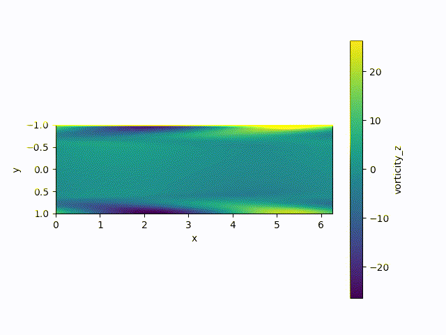

# Jax-Optim

This repository contains a spectral solver written in python. Notably, the
library jax is used, so that automatic differentiation is supported. The main
purpose of this project is to implement a Navier-Stokes DNS solver. 

## Getting started

### Dependencies

- python
- [jax](https://github.com/google/jax)
- notably, [jax-cfd](https://github.com/google/jax-cfd) is not needed.

### Running a case

Check out the functions defined in `test.py` for examples. The functions
starting with "test" can also be used in order to check that everything is
working fine. Functions that run the solver but to not contain any quantitative
test start with "run".

## Example outputs

