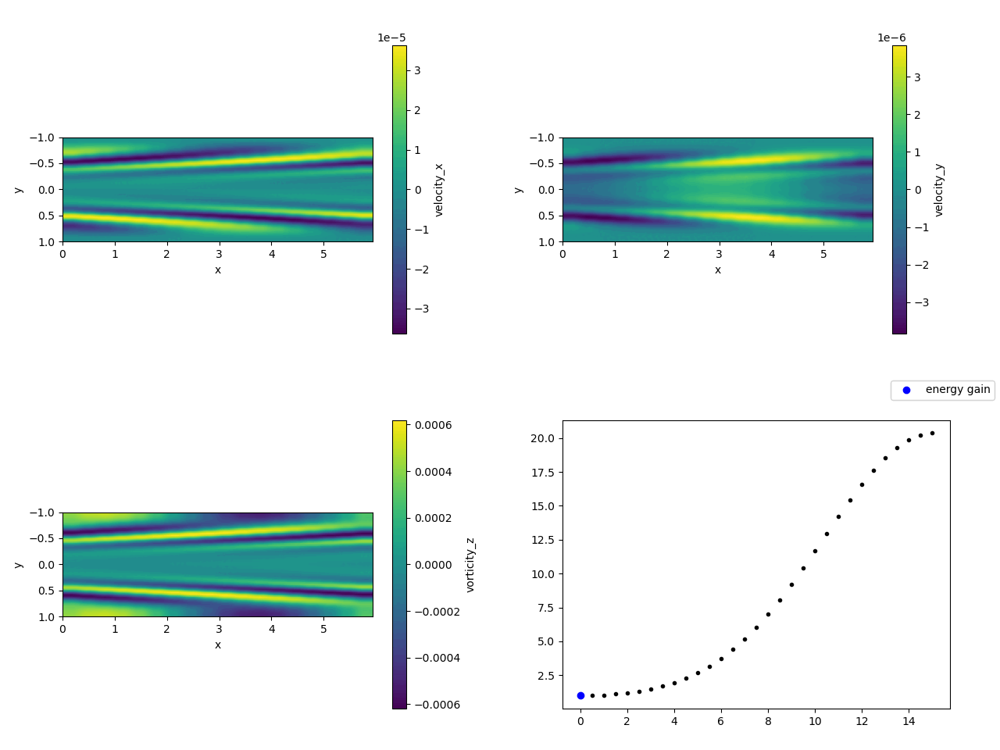

# Jax-Optim

This repository contains a spectral solver written in python. Notably, the
library [jax](https://github.com/google/jax) is used, so that automatic
differentiation is supported. The main purpose of this project is to implement a
Navier-Stokes DNS solver. 

## Getting started

### Dependencies

- python, obviously
- some standard python libraries (mostly used for post-processing):
    - numpy
    - scipy
    - matplotlib
- [jax](https://github.com/google/jax)
- (notably, [jax-cfd](https://github.com/google/jax-cfd) is not needed.)

### Checking if everything is set up correctly

Run `pytest` (`python test_project.py` also works) in order to verify that all
tests are running correctly.  Any state committed to the main branch should pass
all tests (this is not necessarily true for other branches).

### Running a case

Check out the functions defined in `examples.py` and `test_project.py` for examples. The
functions in `test_project.py` are used in order to check that everything is working
fine. Functions in `examples.py` run the solver but to not contain any
quantitative tests.

## Example outputs

### Validation cases:

#### test_growth_rates_quantitatively

This test checks the growth rates of the most unstable modes for $\text{Re}=5500$,
$\text{Re}=5772.22$ and $\text{Re}=6000$ with $\alpha=1.02056$. A plot of the growth rates and a video for Re=6000 are shown below.

#### test_transient_growth

This test checks the growth rates of the optimal transient growth initial
condition according to linear stability analysis for $\text{Re}=600$ and $T=2$ as well as
for $\text{Re}=3000$ and $T=15$. In both cases, $\alpha=1$ and $\beta=0$.
In both cases, the growth rates of
the DNS (using a linearized operator) match very closely with the expected results.

This image shows a time study, where simulations with optimal initial conditions
for different time horizons are run and compared with the data taken from Reddy
& Henningson (1993).

Below, a video of the Re=3000 case with the optimal initial condition for $T=15$
is shown. Since it is run for 40 time units and uses a linearized operator, the
energy decay after $T=15$ is also visible.

<!-- If the same setup is used with the full nonlinear operator, it is clear that the -->
<!-- flow becomes turbulent. -->
<!--  -->
<!--  -->
