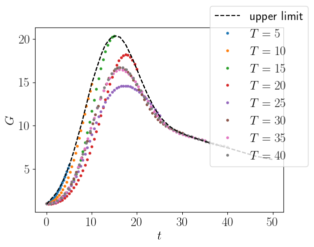
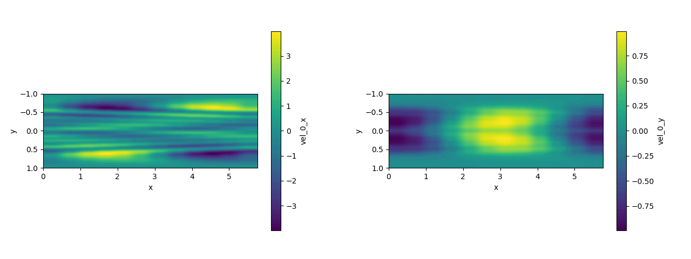

# Jax-Spectral-DNS

This repository contains a spectral solver written in python. Notably, the
library [jax](https://github.com/google/jax) is used, so that automatic
differentiation is supported. The main purpose of this project is to implement a
Navier-Stokes DNS solver. 

## Getting started

### Installation

- clone the gitlab repository:
```
git clone https://gitlab.com/dakling/jax-optim.git ./jax-spectral-dns
```

- install using pip:
```
cd ./jax-spectral-dns
pip install .
```

#### For running on a server

If running on a system without a graphical display, e.g. a server, `pyvista` (which is used for some plotting commands) may require some additional manual setup:
```
cd ./jax-spectral-dns
pip install .
pip uninstall vtk -y
pip uninstall vtk-osmesa -y
pip install --extra-index-url https://wheels.vtk.org vtk-osmesa
```
Note that this can lead to already running jobs using `pyvista` segfaulting, so only run this when necessary (i.e. not everytime you submit a job).
In such a situation, if `jax-spectral-dns` itself is to be reinstalled without it affecting running jobs, consider using
```
cd ./jax-spectral-dns
pip install --no-deps .
```
to avoid the dependencies (in particular `pyvista` and its dependencies) to be reinstalled.


### Dependencies

When using pip for installation as shown above, the python package dependencies
are automatically installed. For those interested, they are still listed here:

- python 3.9+ (python 3.8 also works if the `optax` package is not used. Note that development and testing are done on the latest python version.)
- some python libraries, which are installed by pip automatically (refer to [setup.py](./setup.py) for details)
- optional (for postprocessing with `make-video.sh`):
    - bash or a similiar shell
    - imagemagick (to make gif-files)
    - ffmpeg (to make mp4-files)

### Checking if everything is set up correctly

Run `pytest` (`python test_project.py` also works) in order to verify that all
tests are running correctly.  Any state committed to the main branch should pass
all tests (this is not necessarily true for other branches).

### Running a case

Check out the functions defined in `examples.py` and `test_project.py` for examples. The
functions in `test_project.py` are used in order to check that everything is working
fine. Functions in `examples.py` run the solver but to not contain any
quantitative tests.

The simplest way to run a case from `examples.py` is through the `main.py` file, using 
```
python jax_spectral_dns/main.py <function_name> <function_option_1>=<value_1> <function_option_2>=<value_2> ...
```
so for example
```
python jax_spectral_dns/main.py run_transient_growth Re=3000.0 T=15.0
```
However, the preferred method is creating a yaml-file named `simulation_parameters.yml` 
in the directory from which the code is run. If such a file does not exist and `jax-spectral-dns` 
is invoked with the above command, it will create a template file called `simulation_parameters_.yml` 
(note the extra "_"), which, when renamed to `simulation_parameters.yml`, takes precedence over any passed 
command line arguments. For the above command, the created file would read

``` yaml
Re: 3000.0
T: 15.0
```
The parameters accepted by each function are best found by looking at the source code.
Each parameters has a default value and is thus optional. Superfluous parameters are ignored.

## Example outputs

### Validation cases:

#### test_growth_rates_quantitatively

This test checks the growth rates of the most unstable modes for $\text{Re}=5500$,
$\text{Re}=5772.22$ (the neutral case) and $\text{Re}=6000$ with $\alpha=1.02056$. A plot of the growth rates and a video for Re=6000 are shown below.

||
|:--:| 
|*Growth rates at different Re*|

||
|:--:| 
|*Simulation at Re=6000*|

#### test_transient_growth

This test checks the growth rates of the optimal transient growth initial
condition according to linear stability analysis for $\text{Re}=600$ and $T=2$ as well as
for $\text{Re}=3000$ and $T=15$. In both cases, $\alpha=1$ and $\beta=0$.
In both cases, the growth rates of
the DNS (using a linearized operator) match very closely with the expected results.

This image shows a time study, where simulations with optimal initial conditions
for different time horizons are run and compared with the data taken from Reddy
& Henningson (1993).
||
|:--:| 
|*Growth rates at different times compared with maximum growth over time*|

Below, a video of the Re=3000 case with the optimal initial condition for $T=15$
is shown. 

||
|:--:| 
|*Simulation of initial condition optimised for maximum gain at $T=15$*|

### Gradient-based optimisation

#### Automatic differentiation

While the initial condition in the `test_transient_growth` case is obtained
through linear stability theory, it is also possible to find it using
gradient-based optimisation, where the necessary gradients are computed using
`jax`'s automatic differentiation capabilities.  This is done in
`run_optimisation_transient_growth` and
`run_optimisation_transient_growth_y_profile` (the latter enforces $\alpha=1$,
which does not make a big difference in this case).

This approach is more computationally expensive, but has the advantage that it
generalizes to the nonlinear case, and that the method can be used in other
optimisation problems as well.

Below, the output of a run of `run_optimisation_transient_growth_y_profile` is shown. 
Even though the optimiser is only run for twenty iterations, a clear improvement
from an energy gain of $1.24$ up to a gain of $19.29$ is achieved. Getting closer to 
the expected gain of $20.36$ would likely require more iterations.
Nonetheless, the initial condition is optimised until it qualitatively resembles
the one shown in the `test_transient_growth` section, and the simulation
also matches up nicely, at least qualitatively.

||
|:--:| 
|*Evolution of the initial condition as the optimisation progresses*|

||
|:--:| 
|*Simulation using the final optimised initial condition*|

#### Adjoint-based differentiation

This code also supports calculating gradient using the solution of the adjoint
Navier-Stokes equations (in perturbation formulation). The drawback compared to
automatic differentiation is the requirement to write a custom solver for each
optimisation problem, but once implemented, runtime and memory usage should be
better than automatic differentiation. The case
`run_optimisation_transient_growth_dual` shows this feature in use.

## Contributing 

The `main` branch is protected, so in order to push there, one needs to open a
merge request in gitlab. This automatically triggers the test pipeline, ensuring
that code on `main` always works (at least as far as testing coverage can
ensure).

One can run the test suite manually as described above (alternatively, refer to
[`.gitlab-ci.yml`](./.gitlab-ci.yml)) to see what is done exactly.

When adding any new functionality, please also add one or more corresponding
tests to [`tests/test_project.py`](./tests/test_project.py).

In addition to the test suite, `mypy` is run to catch type errors, meaning that
any new code is required to have appropriate type annotations (see [the mypy
documentation](https://mypy.readthedocs.io/en/stable/)). Some convenient type
definitions are provided in [`jax_spectral_dns/_typing.py`](./jax_spectral_dns/_typing.py). Please also add any
new type definitions there.

To run `mypy`'s tests manually, run
```
mypy jax_spectral_dns/
```
for the code base itself and 
```
mypy tests/test_project.py
```
for the test suite. The [`mypy` configuration file](./mypy.ini), which determines the level of
strictness, is also part of the repository.

### Code formatting

Code autoformatting is implemented using black and pre-commit. The configuration
for pre-commit and black is in [`.pre-commit.yaml`](./.pre-commit.yaml) To enable formatting
being run automatically upon a commit, run 
```
pre-commit install
```
Doing this is recommended as code formatting is enforced by the pipeline, so
poorly formatted code will be rejected automatically.
