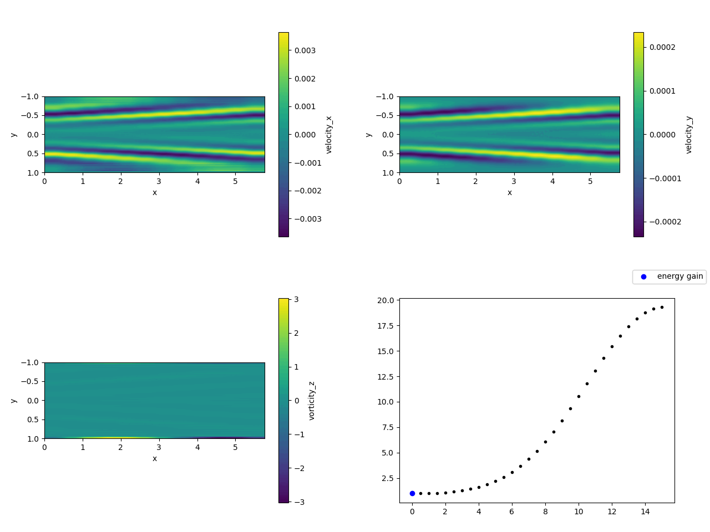

# Jax-Spectral-DNS

This repository contains a spectral solver written in python. Notably, the
library [jax](https://github.com/google/jax) is used, so that automatic
differentiation is supported. The main purpose of this project is to implement a
Navier-Stokes DNS solver. 

## Getting started

### Installation

- clone the gitlab repository:
```
git clone https://gitlab.com/dakling/jax-optim.git ./jax-spectral-dns
```

- install using pip:
```
cd ./jax-spectral-dns
pip install .
```


### Dependencies

When using pip for installation as shown above, the python package dependencies
are automatically installed. For those interested, they are still listed here:

- python, obviously
- some standard python libraries (mostly used for pre- and post-processing):
    - numpy
    - scipy
    - matplotlib
- [jax](https://github.com/google/jax)
- optional (for using optimiser.py):
    - jaxopt
    - optax
- (notably, [jax-cfd](https://github.com/google/jax-cfd) is not needed.)
- optional (for postprocessing with `make-video.sh`):
    - bash or a similiar shell
    - imagemagick (to make gif-files)
    - ffmpeg (to make mp4-files)

### Checking if everything is set up correctly

Run `pytest` (`python test_project.py` also works) in order to verify that all
tests are running correctly.  Any state committed to the main branch should pass
all tests (this is not necessarily true for other branches).

### Running a case

Check out the functions defined in `examples.py` and `test_project.py` for examples. The
functions in `test_project.py` are used in order to check that everything is working
fine. Functions in `examples.py` run the solver but to not contain any
quantitative tests.

The simplest way to run a case from `examples.py` is through the `main.py` file, using 
```
python jax_spectral_dns/main.py <function_name> <function_args>
```
so for example
```
python jax_spectral_dns/main.py run_transient_growth 3000 15
```

## Example outputs

### Validation cases:

#### test_growth_rates_quantitatively

This test checks the growth rates of the most unstable modes for $\text{Re}=5500$,
$\text{Re}=5772.22$ and $\text{Re}=6000$ with $\alpha=1.02056$. A plot of the growth rates and a video for Re=6000 are shown below.

||
|:--:| 
|*Growth rates at different Re*|

||
|:--:| 
|*Simulation at Re=6000*|

#### test_transient_growth

This test checks the growth rates of the optimal transient growth initial
condition according to linear stability analysis for $\text{Re}=600$ and $T=2$ as well as
for $\text{Re}=3000$ and $T=15$. In both cases, $\alpha=1$ and $\beta=0$.
In both cases, the growth rates of
the DNS (using a linearized operator) match very closely with the expected results.

This image shows a time study, where simulations with optimal initial conditions
for different time horizons are run and compared with the data taken from Reddy
& Henningson (1993).
||
|:--:| 
|*Growth rates at different times compared with maximum growth over time*|

Below, a video of the Re=3000 case with the optimal initial condition for $T=15$
is shown. 

||
|:--:| 
|*Simulation of initial condition optimised for maximum gain at $T=15$*|

### Gradient-based optimisation

While the initial condition in the `test_transient_growth` case is obtained
through linear stability theory, it is also possible to find it using
gradient-based optimisation.  This is done in
`run_optimisation_transient_growth` and
`run_optimisation_transient_growth_y_profile` (the latter enforces $\alpha=1$,
which does not make a big difference in this case).

This approach is more computationally expensive, but has the advantage that it
generalizes to the nonlinear case, and that the method can be used in other
optimisation problems as well.

Below, the output of a run of `run_optimisation_transient_growth_y_profile` is shown. 
Even though the optimiser is only run for twenty iterations, a clear improvement
from an energy gain of $1.24$ up to a gain of $19.29$ is achieved. Getting closer to 
the expected gain of a bit above $20$ would likely require more iterations.
Nonetheless, the initial condition is optimised until it qualitatively resembles
the one shown in the `test_transient_growth` section, and the simulation
also matches up nicely, at least qualitatively.

||
|:--:| 
|*Evolution of the initial condition as the optimisation progresses*|

||
|:--:| 
|*Simulation using the final optimised initial condition*|
